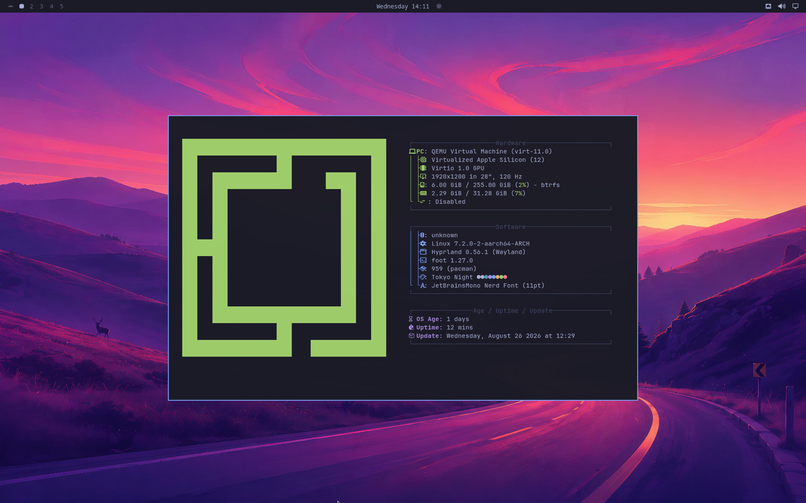
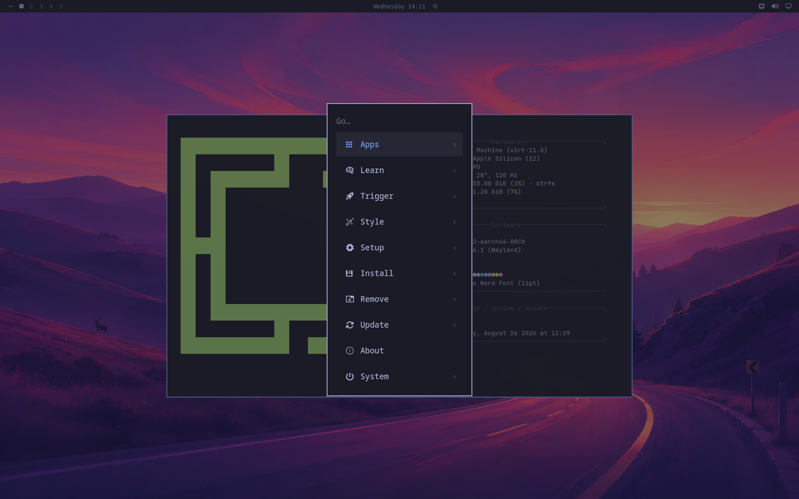
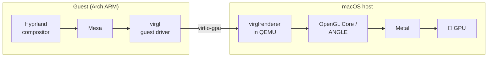

<div align="center">

# 🖥️ Omarchy on Apple Silicon — GPU-Accelerated VM

**The full [Omarchy](https://omarchy.org) desktop — Arch Linux ARM + Hyprland —
running on your Mac's actual GPU, in a contained, scriptable QEMU VM.**

No bare-metal install. No UTM. No compromises on the pretty.



[](LICENSE)
[]()
[]()
[]()
[]()

</div>

---

## ✨ What you get

| | |
|---|---|
| ⚡ **Native CPU speed** | Hypervisor.framework — zero emulation, aarch64 all the way |
| 🎮 **GPU compositing** | Hyprland renders on the host GPU: `virgl → ANGLE/Metal → Apple Silicon` |
| 🖥️ **120 Hz virtual display** | QEMU EDID patch advertises a 120 Hz mode; Hyprland paces to it |
| 🤖 **Agent-ready** | SSH + QMP + serial console + in-guest `grim`/`hyprctl` — built to be driven by code |
| 🪟 **Native window** | cocoa display backend — no VNC client needed |
| 📦 **Fully contained** | One qcow2, one launch script. Delete the folder, it's gone |

Proof from inside the guest: `Renderer: virgl (Apple M3 Ultra)` —
the compositor is literally running on the Mac's GPU.

## 🚀 Quick start

### 1. Prerequisites

macOS on Apple Silicon + Homebrew, then:

```sh
# startergo's macOS virgl/ANGLE stack (third-party taps)
brew tap startergo/virglrenderer && brew trust startergo/virglrenderer
brew tap startergo/libepoxy     && brew trust startergo/libepoxy
brew tap startergo/angle        && brew trust startergo/angle
brew install startergo/virglrenderer/virglrenderer \
             startergo/libepoxy/libepoxy startergo/angle/angle

brew install meson ninja pkg-config glib pixman dtc gnutls jpeg-turbo libpng \
             libssh libusb lzo ncurses nettle sdl2 snappy spice-protocol gmp \
             zstd gettext libslirp capstone

# one-time fix: the libepoxy bottle ships with a broken code signature
codesign --force --sign - /opt/homebrew/Cellar/libepoxy/*/lib/libepoxy.0.dylib
```

### 2. Build the QEMU (~20–40 min, once)

```sh
./build/build-qemu-gpu.sh
```

This compiles QEMU pinned to the exact upstream commit the virgl/ANGLE patches
were written for, adds this repo's **120 Hz EDID patch**, enables slirp
networking (which the prebuilt bottles lack), signs the binaries with the
hypervisor entitlement, and installs to `~/omarchy-vm/qemu-gpu2`.

### 3. Get the Omarchy ARM disk

```sh
mkdir -p ~/omarchy-vm && cd ~/omarchy-vm

# prebuilt image (3.6 GB):
curl -LO https://archive.org/download/omarchy-arm-utm/omarchy-arm-utm-v2.zip
unzip omarchy-arm-utm-v2.zip
cp "Omarchy ARM v5.utm/Data/"*.qcow2 omarchy.qcow2
cp "Omarchy ARM v5.utm/Data/efi_vars.fd" efi_vars_64m.fd
truncate -s 64M efi_vars_64m.fd   # QEMU virt wants 64 MiB pflash vars
```

(Or build the image yourself with
[ggalancs/omarchy-arm-utm](https://github.com/ggalancs/omarchy-arm-utm).)

### 4. One-time guest config

Boot once, then copy the files from [`guest-config/`](guest-config/) into the
guest (default login `omarchy`/`omarchy` — **change it**):

| repo file | guest destination | what it does |
|---|---|---|
| `etc/environment.d/90-vm-graphics.conf` | `/etc/environment.d/` | picks the virgl render node, stops forcing software GL |
| `uwsm/env.d/20-vm-graphics` | `~/.config/uwsm/env.d/` | same, for the uwsm session |
| `uwsm/env.d/30-qt-software` | `~/.config/uwsm/env.d/` | bar/shell via Qt raster (see caveats) |
| `hypr/monitors.lua` | `~/.config/hypr/` | `preferred` mode → 120 Hz |
| `hypr/input.lua` | `~/.config/hypr/` | US keyboard layout (image ships with `es`) |
| `systemd-user/wayvnc.service` | `~/.config/systemd/user/` | VNC for Screen Sharing — `loginctl enable-linger $USER && systemctl --user enable --now wayvnc` |

Then, from the UEFI shell (a USB keyboard is attached for exactly this),
fix the boot entry once so the VM auto-boots forever:

```
bcfg boot add 0 fs0:\EFI\BOOT\BOOTAA64.EFI "Omarchy"
reset
```

And enable SSH for the agent channel:

```sh
sudo systemctl enable --now sshd
```

### 5. Run it

```sh
./scripts/start-vm.sh            # native cocoa window opens
HEADLESS=1 ./scripts/start-vm.sh # GPU mode, window miniaturized in the Dock —
                                 # full acceleration, zero screen clutter
                                 # (agents drive via SSH/grim; click the Dock
                                 #  icon any time to peek)
./scripts/stop-vm.sh             # graceful shutdown
```

<div align="center">

</div>

## 🏗️ How the GPU pipeline works



Venus (Vulkan-over-virtio) is the next frontier — it currently dies on
`SOCK_SEQPACKET`, which XNU doesn't implement. If you want to be a hero,
that's the patch to write. See [issues](../../issues).

## 🤖 Driving it with an agent

Everything an automation loop needs:

```sh
# eyes (in-guest — QMP screendump is black while GL is active)
ssh -p 2222 omarchy@127.0.0.1 'XDG_RUNTIME_DIR=/run/user/1000 \
    WAYLAND_DISPLAY=wayland-1 grim /tmp/shot.png'

# hands
python3 scripts/qmp.py ~/omarchy-vm/qmp.sock send-key \
    '{"keys": [{"type": "qcode", "data": "ret"}]}'
python3 scripts/type_keys.py "hello omarchy"          # type strings via QMP
ssh -p 2222 omarchy@127.0.0.1 'hyprctl ...'           # or in-guest control

# serial console (pre-SSH debugging)
./scripts/serial-cmd.exp 'uname -a'
```

## ⚠️ Caveats — read before filing issues

- **Compositor: GPU. GL-native app windows: still software.** virgl dmabuf
  import into Hyprland doesn't composite on macOS hosts yet, so Qt/GL clients
  are pinned to raster (`QT_QUICK_BACKEND=software`). In practice: fast,
  stable, smooth 120 Hz — app contents just render on llvmpipe (which, on an
  M-series, is honestly fine for terminals and UI).
- QEMU-level VNC conflicts with the GL context, so VNC is served by **wayvnc
  inside the guest** instead — the real GPU-composited desktop, works
  headless. wayvnc's auth is RA2/RSA-AES, which macOS Screen Sharing does
  not support; use TigerVNC (`brew install --cask tigervnc`) and connect to
  `127.0.0.1:5901`. Service: `guest-config/systemd-user/wayvnc.service`.
- Software cursor is intentional (`WLR_NO_HARDWARE_CURSORS=1`).
- This is a stack of patches on pinned source, not a product. It works great
  on the machine it was built on (M3 Ultra / macOS Tahoe); YMMV elsewhere —
  reports welcome.

## 🙏 Prior art & credits

Standing on shoulders:

- **[basecamp/omarchy](https://github.com/basecamp/omarchy)** — the distro itself (DHH & co)
- **[ggalancs/omarchy-arm-utm](https://github.com/ggalancs/omarchy-arm-utm)** — the Omarchy 4 ARM image + the writeup that made this tractable
- **[startergo/homebrew-qemu-virgl-kosmickrisp](https://github.com/startergo/homebrew-qemu-virgl-kosmickrisp)** — macOS virgl/ANGLE/KosmicKrisp packaging; two patches vendored here
- **[@akihikodaki](https://gist.github.com/akihikodaki/87df4149e7ca87f18dc56807ec5a1bc5)** — the original virgl-on-macOS work
- **[UTM — Neptune](https://blog.getutm.app/2026/introducing-neptune-direct3d-virtualization-for-qemu/)** — Venus+MoltenVK state of the art on macOS

## 📜 License

GPL-2.0 — we ship patches to QEMU, so it couldn't be anything else.
